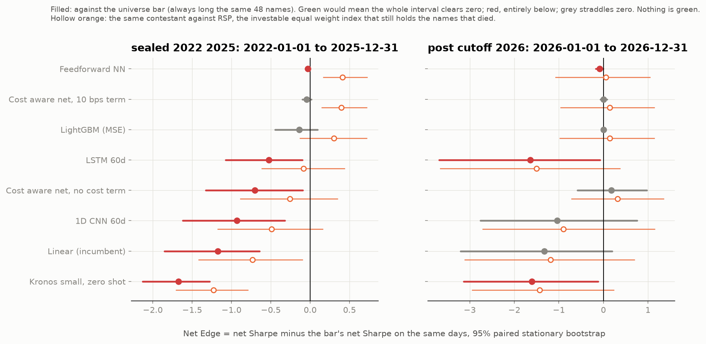
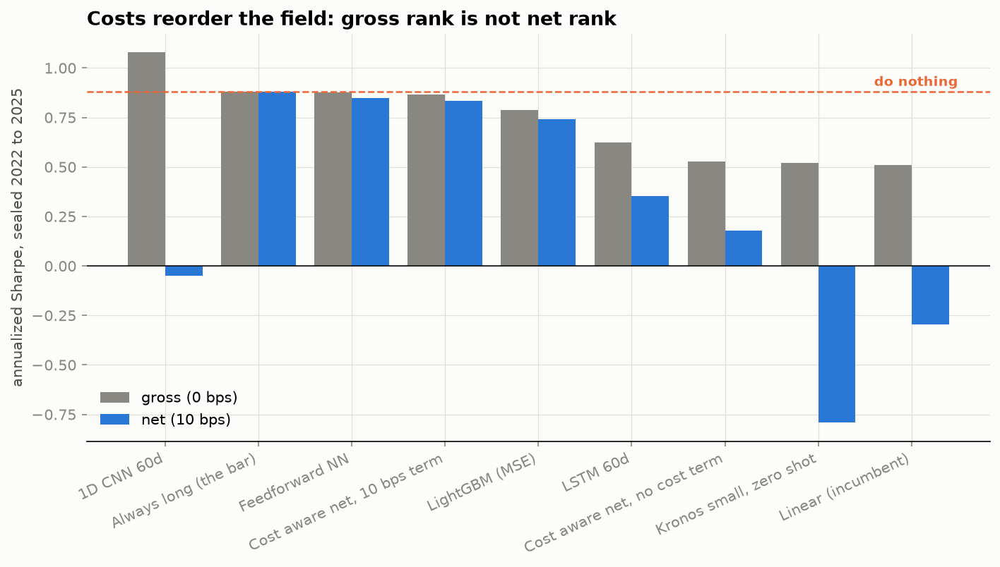
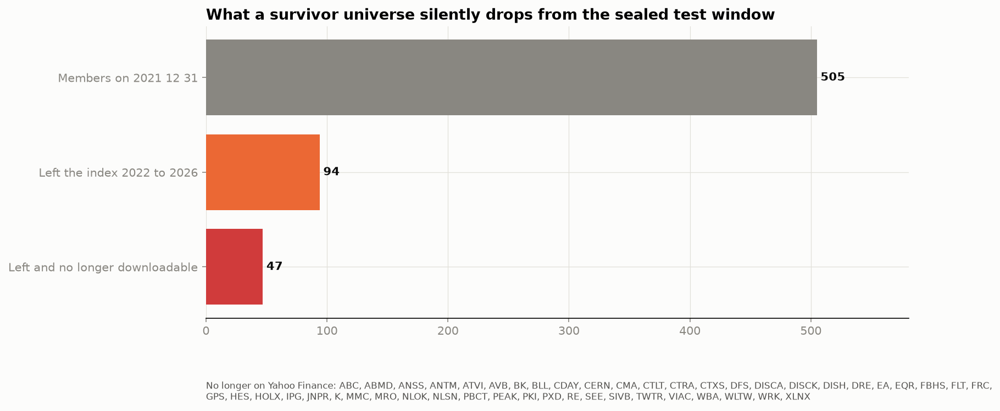
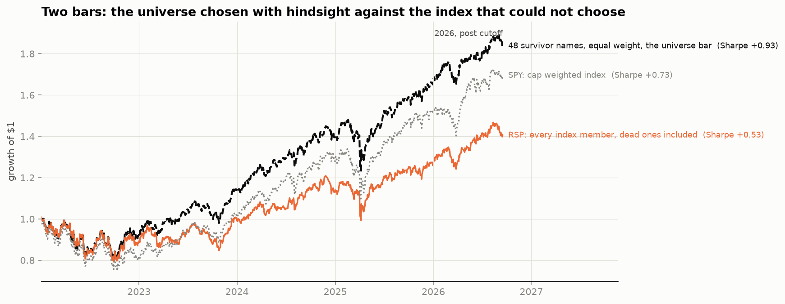

# beatnothing

[](https://github.com/kaustubhspatil/beatnothing/actions/workflows/tests.yml)
[](https://pypi.org/project/beatnothing/)
[](LICENSE)

**Can your model beat doing nothing, after costs, without knowing the future?**

Every quant paper has a chart that goes up and to the right. This benchmark asks that
chart one question. It hands the same prices to the dumbest strategy imaginable, hold
everything at equal weight and never think again, charges both of them the same fee on
every trade, refuses to let either one see tomorrow, and measures the gap with an error
bar. That gap is the **Net Edge**. Nine contestants have tried so far, from an ordinary
linear regression to a 2026 financial foundation model with a hundred times the
parameters. **None of them clears the bar.**

<p align="center">
  
</p>

```bash
pip install beatnothing
```

## The rules of the game

<table>
<tr><th>Rule</th><th>What it means in practice</th></tr>
<tr><td><strong>One engine</strong></td><td>Predictions become positions by one fixed rule: equal weight long every name with a positive value, cash otherwise. Weights are used as given, long only, no leverage. Nobody gets a custom backtester.</td></tr>
<tr><td><strong>One bar, and a second one that could not choose</strong></td><td>The universe bar: always long, equal weight, same universe, same days, same costs. The thing you would earn with zero skill on the names you picked. Beside it, the investable bar: RSP, the equal weight S&amp;P 500 ETF, which holds every index member by construction, dead ones included, and cannot have picked its universe with hindsight. The gap between the two bars is what picking the universe was worth.</td></tr>
<tr><td><strong>Costs on every trade</strong></td><td>10 bps per unit of turnover, day one included. Gross and 20 bps numbers sit beside the net number so you can see who only wins for free.</td></tr>
<tr><td><strong>One score</strong></td><td>Net Edge = your net Sharpe minus the bar's net Sharpe on the same days, with a 95% paired stationary block bootstrap interval. You clear the bar only when the whole interval is above zero.</td></tr>
<tr><td><strong>Frozen means frozen</strong></td><td>Every submission records the sha256 of its model files and a registration date. A monthly job pulls new prices and rescores everything on the days that arrived after registration. Signals never change; only the calendar does.</td></tr>
</table>

## Scoreboard, first season

Sealed window 2022 to 2025, 48 large cap US stocks, net of 10 bps. Full detail with
drawdowns, exposure and dollars in [`leaderboard/LEADERBOARD.md`](leaderboard/LEADERBOARD.md).

<table>
<tr><th>Contestant</th><th>Net Edge</th><th>95% interval</th><th>Edge vs RSP</th><th>Net Sharpe</th><th>Gross Sharpe</th><th>Turnover a year</th></tr>
<tr><td>Always long, the universe bar</td><td>0.00</td><td></td><td>+0.44 [+0.19, +0.76]</td><td>+0.88</td><td>+0.88</td><td>0.3×</td></tr>
<tr><td>Feedforward network</td><td>−0.03</td><td>[−0.06, −0.01]</td><td>+0.41 [+0.17, +0.72]</td><td>+0.85</td><td>+0.88</td><td>4.3×</td></tr>
<tr><td>Cost aware network, 10 bps term</td><td>−0.04</td><td>[−0.10, +0.01]</td><td>+0.40 [+0.15, +0.72]</td><td>+0.83</td><td>+0.87</td><td>2.9×</td></tr>
<tr><td>LightGBM, MSE objective</td><td>−0.14</td><td>[−0.45, +0.09]</td><td>+0.30 [−0.13, +0.72]</td><td>+0.74</td><td>+0.79</td><td>7.2×</td></tr>
<tr><td>LSTM, 60 day windows</td><td>−0.53</td><td>[−1.07, −0.10]</td><td>−0.08 [−0.61, +0.44]</td><td>+0.35</td><td>+0.62</td><td>43×</td></tr>
<tr><td>Cost aware network, no cost term</td><td>−0.70</td><td>[−1.33, −0.09]</td><td>−0.26 [−0.89, +0.35]</td><td>+0.18</td><td>+0.53</td><td>11.5×</td></tr>
<tr><td>1D CNN, 60 day windows</td><td>−0.93</td><td>[−1.62, −0.32]</td><td>−0.49 [−1.17, +0.16]</td><td>−0.05</td><td>+1.08</td><td>265×</td></tr>
<tr><td>Linear regression, the incumbent</td><td>−1.17</td><td>[−1.85, −0.64]</td><td>−0.73 [−1.42, −0.10]</td><td>−0.30</td><td>+0.51</td><td>159×</td></tr>
<tr><td>Kronos small, zero shot</td><td>−1.67</td><td>[−2.13, −1.28]</td><td>−1.23 [−1.71, −0.79]</td><td>−0.79</td><td>+0.52</td><td>241×</td></tr>
</table>

Read the two edge columns together. Three contestants clear RSP on the sealed window, and
so does the universe bar itself, by the same margin. They are not beating the index; the
universe is. A contestant that clears the investable bar while failing the universe bar
has demonstrated one thing only: that its universe was chosen with hindsight.

On the 176 trading days of 2026 that none of the frozen models had ever seen, the order
reproduces, every interval widens to include zero, and the two bars converge (RSP 1.30,
universe bar 1.44, gap inside the noise). Eight months cannot separate a network from a
bar. The leaderboard says so instead of ranking noise.

## What the first season taught us

<p align="center">
  
</p>

* **Costs reorder the field.** The 1D CNN has the highest gross Sharpe of anything, 1.08, and a negative net Sharpe, because it turns the book over 265 times a year. Gross rank is not net rank. Papers that report gross numbers are reporting a different sport.
* **The MSE optimum is nearly always long.** LightGBM, early stopped honestly on validation loss, stops after three trees and holds 47 of 48 names. Squared error on daily returns is minimised by predicting the drift, and the drift is the bar wearing a different hat.
* **A foundation model obeys the same arithmetic as a linear regression.** Kronos small, pretrained on 12 billion bars across 45 exchanges and used zero shot, has a gross Sharpe of 0.52 and a net Sharpe of minus 0.79, with a 53% drawdown, because it flips positions 241 times a year. A hundred times the parameters of the feedforward network; the same cost inversion as the incumbent.
* **A cost aware objective repairs turnover, not alpha.** A network trained end to end on net Sharpe with a 10 bps turnover term trades three times a year instead of twelve and lands within 0.05 of the bar across three seeds, holding half the book in cash. Remove the cost term and the identical architecture loses 0.7 of Sharpe to fees. Given the true objective, the optimiser finds the bar.

## Verify your verifier

Most leakage is not in the model. It is in the evaluation. So the harness ships
contestants that cheat on purpose, and you run them through *your* pipeline first:

```python
from beatnothing import Backtest, peek, off_by_one, hindsight_universe
Backtest(actual, predictions=peek(actual)).stats()["net_sharpe"]      # tomorrow's return as today's signal: absurd, or your pipeline is broken
Backtest(actual, predictions=hindsight_universe(actual, 10)).stats()  # the ten best names of the whole window, chosen at the start
```

If a canary does not score absurdly well, your pipeline is not measuring what you think.
The `truncation_test` in the same module proves a feature builder is trailing only by
deleting the future, recomputing, and demanding byte identical rows.

## The universe knew the future

<p align="center">
  
</p>

"The current S&amp;P 500 constituents" is a list of companies that survived. The
package ships point in time membership from 1996 to 2026 (`beatnothing members
2008-09-15` prints who was actually in the index on the Lehman weekend) and a coverage
report that states, in numbers, what a free price source can no longer supply. For the
sealed window: 94 of the 505 members on the last day of 2021 left the index, and 47 of
those have no prices on Yahoo Finance any more, both 2023 bank failures among them.
That is the residual survivorship gap in this first season, and it is stated rather
than hidden.

<p align="center">
  
</p>

It is also priced. RSP, the equal weight S&amp;P 500 ETF, is the same idea as the
universe bar applied to the whole index, and it could not pick its members with
hindsight. On the sealed window the 48 name bar earned a Sharpe of 0.88 against 0.44 for
RSP, an edge of +0.44 with an interval of [+0.19, +0.76]. Part of that is a size effect,
since the largest names ran hardest in 2023 to 2025, so read it as an upper bound on
survivorship and a fair measure of hindsight in universe selection. In 2026, where no
hindsight was possible, the two bars sit 0.14 apart with an interval that spans a full
Sharpe point in each direction. Every contestant now carries an edge against both bars.

A probe of a paid archive found 45 of the 47 vanished names in its delisted index and the
other two renamed and still trading, so season two can run on the universe that did not
know the future.

## Enter a contestant

A submission is a folder with a signal file and a metadata file; the engine does the
rest. Read [`contestants/README.md`](contestants/README.md), then open a pull request
with `submissions/<name>/`. Two reference scripts show the full path from raw prices to
a submission: a pretrained foundation model used without training, and a network
trained end to end on net Sharpe with three seeds.

## Use it as a library, or from the shell

```python
from beatnothing import Backtest, net_edge
from beatnothing.leaderboard import load_actual, bar_returns
actual = load_actual("data/actual_returns.parquet")          # dates x tickers, next day returns
mine = Backtest(actual, predictions=my_predictions)           # or weights=my_weights
print(net_edge(mine.daily_returns, bar_returns(actual)))     # net edge, interval, clears_bar
```

```bash
beatnothing score my_signal.parquet --actual data/actual_returns.parquet
beatnothing members 2020-03-16
beatnothing leaderboard --root .
```

To rebuild everything from scratch:

```bash
git clone https://github.com/kaustubhspatil/beatnothing && cd beatnothing
pip install -e ".[data,figures,dev]"
pytest -q
python scripts/download_data.py          # prices, features, realised returns, manifest
beatnothing leaderboard
python scripts/make_figures.py
```

## Roadmap

1. **The point in time universe.** Roughly 500 names a day, including the ones that later died, from an archive that keeps delisted histories. Two probe scripts are in `scripts/`, one for a free tier and one for a paid archive; whichever returns the dead names first wins. This turns the universe bar into the investable bar and lets a contestant earn edge by avoiding disasters, which no survivor universe can reward.
2. **Sharper statistics.** The studentized bootstrap of Ledoit and Wolf for Sharpe differences, and a family wise correction so that a crowded leaderboard cannot clear the bar by luck.
3. **A long short engine** with a borrow cost, so that ranking signals can be judged on the book they were built for.
4. **An LLM agent contestant**, in the spirit of StockBench, under the same costs and the same bar.
5. **A year of forward track.** The workflow is armed; the calendar does the rest.

## Honest limits

* The season one universe is a survivor universe: 48 names chosen in August 2026, ten of which joined the index after 2005. It flatters every contestant and the bar equally, so Net Edge survives it. Absolute numbers do not.
* Costs are a flat 10 bps. No market impact, no borrow, no slippage that grows with size. It is the friction a small book pays.
* Long or flat only, no leverage.
* Eight months is not evidence. Check back in a year.

## Cite

```
Patil, K. (2026). beatnothing: a net of cost benchmark for daily equity signals. https://github.com/kaustubhspatil/beatnothing
```

A `CITATION.cff` is included. The first five contestants come frozen from the
[deep learning equity signal capstone](https://github.com/kaustubhspatil/sp500-quantitative-deep-learning),
where their training is documented notebook by notebook.

## Credits

Point in time membership: [fja05680/sp500](https://github.com/fja05680/sp500), MIT.
Kronos: Shi et al., *Kronos: A Foundation Model for the Language of Financial Markets*,
AAAI 2026, [the Kronos repository](https://github.com/shiyu-coder/Kronos), MIT. Stationary
bootstrap: Politis and Romano (1994). Probabilistic Sharpe ratio: Bailey and Lopez de
Prado (2012). Sharpe standard error: Lo (2002). Prices from Yahoo Finance through
yfinance; the snapshot hash is in `data/MANIFEST.json`.

MIT licensed. Built by Kaustubh Patil.
